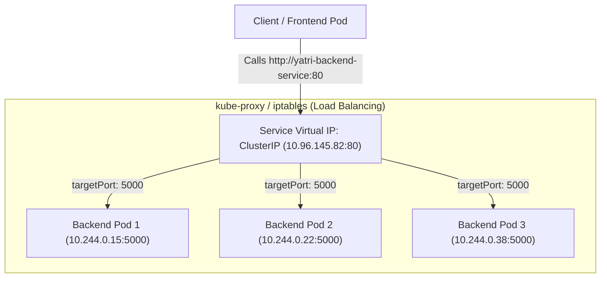
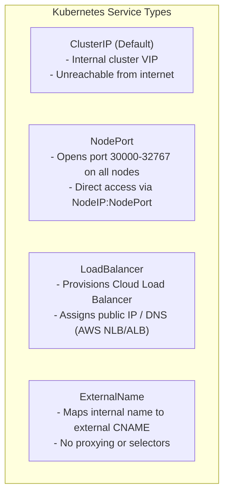

# Session 11: Kubernetes Networking & Services

Pods are ephemeral. When a Pod crashes, updates, or scales, it is replaced with a new Pod that receives a **brand-new, unpredictable IP address**. If microservices communicated by hardcoding Pod IPs, every restart would trigger a cascading outage.

A **Kubernetes Service** provides a stable virtual IP address (ClusterIP) and a permanent DNS name that never changes, dynamically load-balancing traffic across all healthy backend Pods.

---

## What will you learn?

* Understand the fundamental Kubernetes flat networking model and the **3 Golden Rules of Pod Networking**.
* Decouple Pod lifecycles from network communication using the **Service abstraction**.
* Demystify port mappings: The definitive difference between **`port`**, **`targetPort`**, and **`nodePort`**.
* Master the 4 Service Types:
  * **`ClusterIP`** (Default): Internal cluster-only communication.
  * **`NodePort`**: Exposes the service on a static high port (`30000–32767`) across every worker node.
  * **`LoadBalancer`**: Provisions an external cloud load balancer (e.g., AWS NLB/ALB) with a public IP.
  * **`ExternalName`**: Maps internal service names to external CNAMEs (e.g., AWS RDS endpoints).
* Understand cluster-internal DNS resolution via **CoreDNS**, `/etc/resolv.conf`, and Fully Qualified Domain Names (FQDNs).
* Troubleshoot the #1 Kubernetes networking error: **Empty Endpoints (`<none>`)**.

---

## Why does this matter?

In a distributed microservice architecture, your frontend UI needs to talk to your backend API. You cannot hardcode `http://10.244.1.15:5000` because the moment that pod crashes or scales, that IP address is gone forever.

With a Kubernetes Service, the frontend simply sends requests to `http://yatri-backend-service:80`. CoreDNS resolves that name to the stable virtual IP, and Linux kernel routing (`kube-proxy` via `iptables` or `IPVS`) distributes incoming requests across all healthy backend pods. Without Services, microservice architectures in Kubernetes cannot operate.

---

## Core Concepts Explained

### 1. First Question: How Does Kubernetes Pod Networking Work?

In traditional virtual machine or container setups, containers often sit behind private bridges with host port mappings (`-p 8080:80`). In a Kubernetes cluster with thousands of pods across hundreds of nodes, port collision management would be unworkable.

Kubernetes enforces a clean, flat networking model defined by **The 3 Golden Rules**:
1. **All Pods can communicate with all other Pods without NAT** (across any node in the cluster).
2. **All Nodes can communicate with all Pods without NAT** (and vice versa).
3. **The IP address a Pod sees for itself is the exact same IP address every other Pod sees for it**.

#### The Problem: Ephemeral Pod IPs
Every Pod gets a real, cluster-routable IP address from the Container Network Interface (CNI) plugin (e.g., Calico, Flannel, AWS VPC CNI). However, Pods are disposable.

```text
Old Backend Pod: 10.244.1.15  --> Terminated / Crashed
New Backend Pod: 10.244.2.42  --> Starts with a BRAND-NEW IP!
```

If any client hardcoded `10.244.1.15`, the application would fail immediately with `Connection Refused`. We need an unchanging intermediary: **The Kubernetes Service**.

---

### 2. Second Question: What is a Service? (The Corporate Reception Desk Analogy)

Think of a **Large Corporate Enterprise (The Kubernetes Cluster)**:
* **The Developers / Staff (The Pods):** 5 backend engineers work in the office. They take vacations, change desks, work remotely, or resign. Their locations change constantly.
* **The Corporate Reception Desk (The Service):** The company maintains one static, unchanging reception desk at the entrance.
* **The Receptionist's Live Clipboard (The Endpoints List):** The receptionist maintains an up-to-the-minute list of which engineers are currently seated at their desks.
* When an external visitor or internal colleague needs help, they never wander the building searching for an individual engineer's desk. They walk up to the **Reception Desk (Service Virtual IP)**. The receptionist hands the inquiry to whichever engineer is currently available and healthy.



---

### 3. Third Question: What is the Difference Between `port`, `targetPort`, and `nodePort`?

This is one of the most common points of confusion for Kubernetes beginners. Memorize the **Three Ports Triangle**:

```text
External Internet / User Browser
       |
       | hits physical machine on high port (30000 - 32767)
       v
+--------------+
|   nodePort   |  (e.g. 30080 on the Worker Node IP)
+--------------+
       |
       | forwards internally inside cluster
       v
+--------------+
|     port     |  (Port exposed by the Service inside the cluster, e.g. 80)
+--------------+
       |
       | forwards into container process
       v
+--------------+
|  targetPort  |  (Port where the container app is actually listening, e.g. 5000)
+--------------+
```

* **`port` (The Front Door):** The port exposed by the Service to other services *inside* the cluster. Standard HTTP is `80`.
* **`targetPort` (The Back Door):** The port where the application process inside the container is actively listening (e.g., Flask on `5000`, Spring Boot on `8080`).
* **`nodePort` (The Physical Machine Door):** A static port allocated across every worker node's physical IP address from the range `30000–32767`.

| Port Field | Where It Listens | Who Connects to It? | Example Value |
| :--- | :--- | :--- | :--- |
| **`port`** | Service Virtual IP (ClusterIP) | Internal microservices inside the cluster | `80` |
| **`targetPort`** | Container inside the Pod | Service load balancer (`kube-proxy`) | `5000` |
| **`nodePort`** | Worker Node physical IP | External clients or edge load balancers | `30080` |

---

### 4. Fourth Question: What Are the 4 Kubernetes Service Types?



1. **`ClusterIP` (Default):** Exposes the Service on an internal IP reachable only from within the cluster. Ideal for internal microservice-to-microservice APIs, databases, and caching layers.
2. **`NodePort`:** Builds on top of ClusterIP. Allocates a port in the range `30000–32767` on every node's IP. Anyone with network access to the node can connect via `http://<Node-IP>:<NodePort>`.
3. **`LoadBalancer`:** Builds on top of NodePort and ClusterIP. Asks the cloud provider (AWS, GCP, Azure) to provision an external public Load Balancer that routes incoming internet traffic to the cluster's NodePorts.
4. **`ExternalName`:** Acts as an internal DNS alias (CNAME). When a pod requests `database-service`, CoreDNS returns the external domain (e.g., `mydb.rds.amazonaws.com`).

---

### 5. Fifth Question: How Does Kubernetes Internal DNS (CoreDNS) Work?

Kubernetes runs a cluster-internal DNS service called **CoreDNS**. Every time a Service is created, CoreDNS automatically registers an A-record:

$$\text{Format: } \mathbf{\langle service\text{-}name\rangle.\langle namespace\rangle.svc.cluster.local}$$

* Within the **same namespace**: A pod can simply call `http://yatri-backend-service:80`.
* From a **different namespace**: A pod calls `http://yatri-backend-service.<namespace>.svc.cluster.local:80`.

#### The Container Configuration: `/etc/resolv.conf`
When Kubernetes starts a Pod, it configures DNS lookups automatically:
```text
nameserver 10.96.0.10
search default.svc.cluster.local svc.cluster.local cluster.local
options ndots:5
```
Because `default.svc.cluster.local` is in the search list, typing `yatri-backend-service` automatically completes to the full FQDN and resolves to the Service's ClusterIP!

---

### 6. Sixth Question: What Causes "Empty Endpoints"? (The #1 Triage Scenario)

A Service is just a routing abstraction. The actual destination pod IPs are tracked in an **`Endpoints`** (or `EndpointSlice`) object created by the Endpoints Controller.

If a Service's `spec.selector` has even a single character typo compared to the Pod's `metadata.labels`, the Endpoints Controller finds zero matching pods.
* The Service is created successfully without errors.
* Running `kubectl get endpoints <service>` shows `<none>`.
* Incoming requests hang and fail with `Connection Timed Out` or `HTTP 503`.

---

## Step-by-Step Hands-on Labs

All manifests for this lab are located in:
* `./deployment/backend-deployment.yaml`
* `./service/clusterip.yaml`
* `./service/nodeport.yaml`
* `./service/loadbalancer.yaml`
* `./dns-test/curl-test-pod.yaml`
* `./troubleshooting/empty-endpoints.yaml`

---

### Lab 1: Deploy Backend Pods

Before creating a Service, deploy 3 backend pods running a lightweight Python HTTP server on port 5000:

```bash
kubectl apply -f deployment/backend-deployment.yaml
```
* Explanation: Deploys 3 replicas with label `app: yatri-backend` listening on container port 5000.

Verify pods are running:
```bash
kubectl get pods -l app=yatri-backend -o wide
```

Expected output:
```text
NAME                            READY   STATUS    RESTARTS   AGE   IP            NODE
yatri-backend-7f89d54b8-2k4l9   1/1     Running   0          25s   10.244.0.15   minikube
yatri-backend-7f89d54b8-8p2m1   1/1     Running   0          25s   10.244.0.22   minikube
yatri-backend-7f89d54b8-x9q4t   1/1     Running   0          25s   10.244.0.38   minikube
```

Notice that each pod has a unique private IP address (`10.244.0.15`, etc.).

---

### Lab 2: Expose Backend via ClusterIP

Deploy the internal ClusterIP service:

```bash
kubectl apply -f service/clusterip.yaml
```
* Explanation: Creates a virtual IP listening on port 80 and forwarding to targetPort 5000.

Inspect the service:
```bash
kubectl get svc yatri-backend-service
```

Expected output:
```text
NAME                    TYPE        CLUSTER-IP      EXTERNAL-IP   PORT(S)   AGE
yatri-backend-service   ClusterIP   10.96.145.82    <none>        80/TCP    12s
```

Now inspect the associated Endpoints object:
```bash
kubectl get endpoints yatri-backend-service
```

Expected output:
```text
NAME                    ENDPOINTS                                            AGE
yatri-backend-service   10.244.0.15:5000,10.244.0.22:5000,10.244.0.38:5000   30s
```
* Explanation: The Endpoints Controller automatically matched `selector: app=yatri-backend` and populated the exact IPs and container ports of all 3 running pods!

---

### Lab 3: Test Internal DNS & Service Discovery via Diagnostic Pod

Deploy the test client pod:
```bash
kubectl apply -f dns-test/curl-test-pod.yaml
```

Wait until running:
```bash
kubectl get pod curl-test-pod
```

Test DNS resolution from inside the cluster:
```bash
kubectl exec -it curl-test-pod -- nslookup yatri-backend-service
```

Expected output:
```text
Server:    10.96.0.10
Address:   10.96.0.10#53

Name:      yatri-backend-service.default.svc.cluster.local
Address:   10.96.145.82
```

Send an HTTP request using the service name (no IP addresses needed):
```bash
kubectl exec -it curl-test-pod -- curl -s http://yatri-backend-service:80
```

Expected output:
```text
Backend v1.0.0 listening on port 5000
```

Query the healthcheck endpoint:
```bash
kubectl exec -it curl-test-pod -- curl -s http://yatri-backend-service/healthz
```

Expected output:
```json
{"status":"healthy","service":"yatri-backend"}
```

---

### Lab 4: Expose Backend Externally via NodePort

Deploy the NodePort service:
```bash
kubectl apply -f service/nodeport.yaml
```
* Explanation: Opens port `30080` on every node and forwards to `port 80` -> `targetPort 5000`.

Inspect the NodePort service:
```bash
kubectl get svc yatri-backend-nodeport
```

Expected output:
```text
NAME                     TYPE       CLUSTER-IP      EXTERNAL-IP   PORT(S)        AGE
yatri-backend-nodeport   NodePort   10.96.210.44    <none>        80:30080/TCP   15s
```

Test access directly from your host terminal:
```bash
curl http://localhost:30080
```

Expected output:
```text
Backend v1.0.0 listening on port 5000
```

---

### Lab 5: Cloud LoadBalancer Service

Deploy the LoadBalancer service:
```bash
kubectl apply -f service/loadbalancer.yaml
```

Inspect the service:
```bash
kubectl get svc yatri-backend-lb
```

Expected output (Local Minikube):
```text
NAME               TYPE           CLUSTER-IP      EXTERNAL-IP   PORT(S)        AGE
yatri-backend-lb   LoadBalancer   10.96.180.11    <pending>     80:31254/TCP   10s
```

Expected output (AWS EKS):
```text
NAME               TYPE           CLUSTER-IP      EXTERNAL-IP                                            PORT(S)        AGE
yatri-backend-lb   LoadBalancer   10.96.180.11    a1b2c3d4e5-987654321.us-east-1.elb.amazonaws.com     80:31254/TCP   45s
```
* Explanation: On bare-metal or local Minikube without a cloud controller or `minikube tunnel`, `EXTERNAL-IP` remains `<pending>`. In AWS EKS, AWS provisions an elastic Network Load Balancer automatically.

---

### Lab 6: Triage the "Empty Endpoints" Failure Drill

Deploy the intentionally broken service:
```bash
kubectl apply -f troubleshooting/empty-endpoints.yaml
```

Check the endpoints:
```bash
kubectl get endpoints broken-backend-service
```

Expected output:
```text
NAME                     ENDPOINTS   AGE
broken-backend-service   <none>      12s
```

Attempt to curl the broken service from the diagnostic pod:
```bash
kubectl exec -it curl-test-pod -- curl --connect-timeout 3 http://broken-backend-service
```

Expected output:
```text
curl: (28) Failed to connect to broken-backend-service port 80: Connection timed out
```

#### The 3-Step Triage Formula:
1. **Check Endpoints:** `kubectl get endpoints broken-backend-service` -> Displays `<none>`.
2. **Inspect Service Selector:**
   ```bash
   kubectl describe svc broken-backend-service | grep Selector
   ```
   Output: `Selector: app=wrong-backend-name`
3. **Compare Against Pod Labels:**
   ```bash
   kubectl get pods --show-labels
   ```
   Output: `app=yatri-backend`
4. **Fix:** Update the service YAML so `spec.selector.app` matches `yatri-backend`.

Cleanup broken service:
```bash
kubectl delete -f troubleshooting/empty-endpoints.yaml
```

---

## 5-Minute Revision Checklist

* [ ] I can state the 3 Golden Rules of Kubernetes Pod Networking.
* [ ] I understand why Pod IPs are ephemeral and why microservices require Services.
* [ ] I can explain the Three Ports Triangle: `port` (Service Front Door), `targetPort` (Container Process), and `nodePort` (Worker Node IP).
* [ ] I know that `ClusterIP` is internal only, while `NodePort` and `LoadBalancer` provide external access.
* [ ] I can write the full Kubernetes DNS FQDN syntax: `<service>.<namespace>.svc.cluster.local`.
* [ ] I know that `kubectl get endpoints <service>` is the #1 command to verify if a Service found healthy Pods.
* [ ] I understand that `kube-proxy` programs Linux kernel `iptables` or `IPVS` rules to load-balance traffic across pods.

---

## High-Frequency Interview Preparation

### Beginner Level

#### Q1. What is a Kubernetes Service and why is it necessary?
* **Answer:** A Kubernetes Service is a networking abstraction that defines a logical set of Pods and a policy to access them. Because Pods are ephemeral and receive dynamic IP addresses that change on restart or scaling, Services provide a static virtual IP (ClusterIP) and a permanent DNS name. This ensures clients and other microservices can reliably communicate without tracking individual Pod IPs.

#### Q2. What happens if a Service selector does not match any running Pod labels?
* **Answer:** The Service will be created without errors, but its `Endpoints` object will remain empty (`<none>`). Any traffic sent to the Service will hang and fail with a connection timeout or connection refused because there are no backend destination Pods.

---

### Intermediate Level

#### Q3. Explain the difference between `NodePort` and `LoadBalancer`.
* **Answer:**
  * **`NodePort`:** Opens a dedicated high port from the range `30000–32767` on every worker node's physical IP address. External traffic must connect directly to a specific node IP on that non-standard port.
  * **`LoadBalancer`:** The production-standard mechanism in cloud environments (AWS, GCP, Azure). It automatically provisions a cloud load balancer (e.g., AWS NLB) that accepts traffic on standard ports (`80`, `443`) with a public IP or DNS name and routes it across the cluster's NodePorts automatically.

#### Q4. How does `kube-proxy` direct traffic to Pods?
* **Answer:** `kube-proxy` runs on every worker node as a DaemonSet. It monitors the API server for changes to Services and Endpoints. In modern Kubernetes clusters, it does not proxy traffic through user space; instead, it writes Linux kernel **`iptables`** rules or configures **`IPVS`** (IP Virtual Server) tables to intercept traffic destined for the Service Virtual IP and perform Destination NAT (DNAT) to healthy Pod IPs using random or round-robin balancing.

---

### Advanced & Scenario-Based

#### Q5. Scenario: A frontend pod cannot communicate with `http://yatri-backend-service`. Running `curl` inside the frontend pod times out. Walk through your step-by-step triage workflow.
* **Answer:**
  1. **Check Service Endpoints:** Run `kubectl get endpoints yatri-backend-service`. If it shows `<none>`, there is a label selector mismatch or pods are not ready.
  2. **Verify Pod Labels and Readiness:** Run `kubectl get pods -l app=yatri-backend -o wide`. Ensure pods are in `Running` state and pass their Readiness Probes. (Pods failing readiness are automatically detached from Endpoints!).
  3. **Verify Port Mapping:** Check the Service definition. Ensure `spec.ports.targetPort` matches the actual port where the backend process is listening (e.g., `5000` vs `80`).
  4. **Verify DNS Resolution:** Exec into the frontend pod and run `nslookup yatri-backend-service`. Confirm CoreDNS resolves the name to the Service ClusterIP.
  5. **Check NetworkPolicies:** Verify no Kubernetes `NetworkPolicy` is blocking egress from the frontend or ingress into the backend namespace.

---

## Homework & Hands-on Challenge

1. Deploy `deployment/backend-deployment.yaml` and scale it from 3 to 6 replicas using `kubectl scale deployment yatri-backend --replicas=6`.
2. Run `kubectl get endpoints yatri-backend-service` and observe how all 6 pod IPs are immediately added to the endpoints list.
3. Scale the deployment down to 1 replica and verify the endpoints list shrinks dynamically.
4. Intentionally change `targetPort` in `service/clusterip.yaml` to `9999` and observe the exact error when curling from `curl-test-pod`.

---

## Next Session Connection

In **Session 12: Kubernetes Ingress, ConfigMaps & Secrets**, NodePort opens too many non-standard ports (`:30080`) and LoadBalancer gets expensive if you create one per microservice. You will learn how **Ingress Controllers** route traffic from a single public domain (`yatri.com/api` vs `yatri.com/app`) and manage configuration and passwords securely with ConfigMaps and Secrets.

---

## Submission index & local verification (course submission)

### Service demos (one folder per type)

- [01-clusterip/README.md](01-clusterip/README.md)
- [02-nodeport/README.md](02-nodeport/README.md)
- [03-loadbalancer/README.md](03-loadbalancer/README.md)
- [04-externalname/README.md](04-externalname/README.md)
- [05-headless/README.md](05-headless/README.md)

## Task 2: Object comparison

- [object-comparison.md](object-comparison.md) — Deployment vs ReplicaSet,
  Deployment vs DaemonSet vs StatefulSet, ReplicaSet vs Service.

## Tasks 3 & 4: DNS

- [fqdn/README.md](fqdn/README.md) — Kubernetes FQDN, `svc.ns.svc.cluster.local` naming.
- [coredns/README.md](coredns/README.md) — CoreDNS architecture + troubleshooting.
- (Older combined notes: [fqdn.md](fqdn.md), [service.md](service.md))

## Local verification

On a temporary local Minikube lab cluster, the ClusterIP demo was applied and
a client Pod reached `web-service-clusterip:8080` with `HTTP 200`; `nslookup`
resolved `web-service-clusterip.<ns>.svc.cluster.local` to its ClusterIP. The
other Service types were documented but not exercised live.
