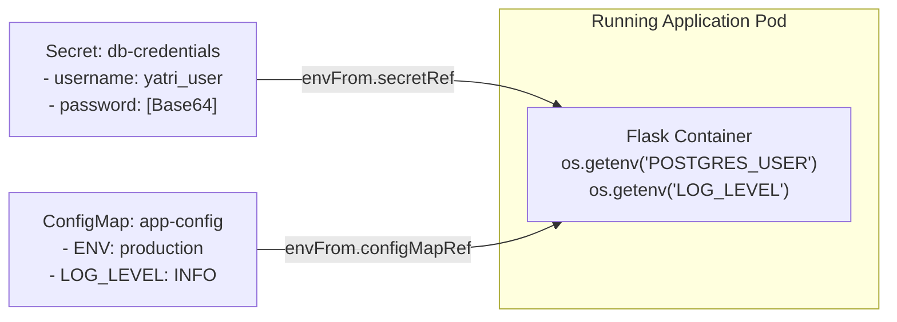

# Session 12: Kubernetes Ingress, ConfigMaps & Secrets

Opening 50 NodePorts or paying for 20 AWS Cloud Load Balancers for every microservice is expensive and unmaintainable. Furthermore, hardcoding database passwords inside container images is an enterprise security violation.  
In this session, we master **Ingress Controllers** for centralized HTTP routing and **ConfigMaps & Secrets** for decoupled configuration.

---

## What will you learn?
- Understand why Services are not enough for HTTP traffic routing: The role of the **Ingress Controller**.
- Master **Host-Based Routing** (`api.yatri.com` vs `portal.yatri.com`) and **Path-Based Routing** (`/` vs `/api/v1`).
- Explore modern Ingress specifications using `networking.k8s.io/v1`.
- Master the Twelve-Factor App principle: **Decoupling configuration from code**.
- Create and inject **ConfigMaps** (plain-text configs) as environment variables and volume mounts.
- Create and inject **Secrets** (sensitive credentials) using Base64 encoding.
- Understand Secret security in Kubernetes: Base64 encoding is **NOT encryption**.
- Troubleshoot the classic "Secret Contains Invalid Trailing Newline" authentication bug.

---

## Why does this matter?
In production, your code should be identical whether running in Development, Staging, or Production. Only the **configuration and credentials** change.  
With ConfigMaps and Secrets, you can deploy the exact same immutable Docker image to Production, simply pointing it to a production database secret.  
And with Ingress, you expose your entire microservices suite behind a single public domain and IP address with SSL/TLS termination, slashing cloud load balancer costs by 80%.

---

## Core Concepts

### Concept 1: Ingress vs NodePort vs LoadBalancer

```mermaid
flowchart TD
    subgraph AntiPattern ["[FAIL] Without Ingress: Expensive & Chaotic"]
        UserA([User]) -->|Port 80| LB1["AWS Load Balancer ($25/mo)"] --> Svc1["Frontend Service"]
        UserB([User]) -->|Port 80| LB2["AWS Load Balancer ($25/mo)"] --> Svc2["Backend API Service"]
        UserC([User]) -->|Port 80| LB3["AWS Load Balancer ($25/mo)"] --> Svc3["Auth Service"]
    end

    subgraph ModernIngress ["[PASS] With Ingress: 1 Single Entry Point"]
        Internet([Public Internet\nhttps://yatri.com]) -->|Port 443 (Single Public IP / LB)| IngressController["NGINX Ingress Controller\n(Layer-7 Reverse Proxy & TLS Termination)"]
        IngressController -->|Path: / | FrontendClusterIP["Frontend Service (ClusterIP)"]
        IngressController -->|Path: /api/* | BackendClusterIP["Backend Service (ClusterIP)"]
    end
```

---

### Concept 2: ConfigMaps vs Secrets

#### 1. What is it?
- **ConfigMap:** A Kubernetes API object used to store non-confidential configuration key-value pairs (e.g. `LOG_LEVEL: DEBUG`, `PORT: 5000`).
- **Secret:** A Kubernetes API object specifically intended to hold sensitive data (e.g. passwords, API tokens, TLS private keys). Encoded in Base64 by default.

#### 2. Explain like I am 5
Think of an **Employee ID Card & Security Locker Key**:
- **ConfigMap (The Employee ID Card):** Displays your name, department, and desk number in plain text on your shirt. Anyone can read it; there are no secrets.
- **Secret (The Digital Safe Keycard):** Kept in a sealed security envelope. Handed only to authorized personnel entering the vault room.

---

### Concept 3: How Secrets are Injected into Pods

You can inject ConfigMaps and Secrets into container workloads in two ways:
1. **As Environment Variables (`env` / `envFrom`):** Injected into the process environment table when the container starts.
2. **As Mounted Files (`volumes` / `volumeMounts`):** Mounted as a read-only directory where each key becomes a filename and each value becomes file content (ideal for TLS certs or `nginx.conf`).



---

## Hands-on Lab: Deploying Ingress, ConfigMaps & Secrets

Manifests are located in `./configmap/`, `./secret/`, and `./ingress/`.

### Step 1: Create the Application ConfigMap
Inspect `./configmap/app-config.yaml` and apply:
```bash
kubectl apply -f ./configmap/app-config.yaml
```

View stored keys:
```bash
kubectl get configmap yatri-app-config -o yaml
```

### Step 2: Create the Database Secret
> Warning: **CRITICAL BASH RULE:** Always use `echo -n` when base64-encoding secrets!  
> Standard `echo` appends a hidden newline character `\n`, which will cause database passwords to fail authentication!

```bash
# Correct way to encode:
echo -n "secretpassword" | base64
# Output: c2VjcmV0cGFzc3dvcmQ=
```

Apply `./secret/db-secret.yaml`:
```bash
kubectl apply -f ./secret/db-secret.yaml
```

### Step 3: Deploy Backend with Injected Environment
```bash
kubectl apply -f ./app/backend-with-config.yaml
```

Verify that the container received the injected variables:
```bash
kubectl exec -it deployment/yatri-backend -- env | grep -E "POSTGRES|LOG_LEVEL|ENVIRONMENT"
```

Expected output:
```text
ENVIRONMENT=production
LOG_LEVEL=INFO
POSTGRES_USER=yatri_admin
POSTGRES_PASSWORD=secretpassword
```

### Step 4: Apply Ingress Routes
```bash
# Enable Ingress addon in Minikube if not already enabled:
minikube addons enable ingress 2>/dev/null || true

kubectl apply -f ./ingress/ingress-routes.yaml
kubectl get ingress yatri-ingress
```

Expected output:
```text
NAME            CLASS   HOSTS         ADDRESS          PORTS   AGE
yatri-ingress   nginx   yatri.local   192.168.49.2     80      20s
```

---

## 5-Minute Revision Checklist
- [ ] I understand that an Ingress is an API object, while the Ingress Controller is the reverse proxy (e.g. NGINX) fulfilling it.
- [ ] I know why we use `echo -n` instead of `echo` when Base64 encoding secrets.
- [ ] I can inject an entire ConfigMap into a Pod using `envFrom.configMapRef`.
- [ ] I know that Kubernetes Secrets are Base64 encoded by default, NOT encrypted at rest unless KMS encryption is enabled.
- [ ] I can write path-based routing rules in `networking.k8s.io/v1` Ingress manifests.

---

## High-Frequency Interview Preparation

### Beginner Level
1. **Q: What is the difference between an Ingress and an Ingress Controller?**  
   - *Good Answer:* "An Ingress is merely a Kubernetes declarative configuration object (the routing rules, paths, and hostnames). An Ingress Controller is the actual running reverse-proxy application (such as NGINX Ingress Controller, Traefik, or AWS Load Balancer Controller) that continuously watches the API server for Ingress objects and updates its routing tables accordingly."

2. **Q: Are Kubernetes Secrets encrypted by default?**  
   - *Good Answer:* "No! By default, Kubernetes Secrets are stored in `etcd` merely as plain text encoded in Base64. Base64 is an encoding format for binary data, not encryption; anyone with access to `etcd` or `kubectl get secret -o yaml` can decode it instantly. In production, clusters must enable **Encryption at Rest** in the API server using KMS (AWS KMS, HashiCorp Vault) and enforce strict RBAC permissions."

### Intermediate Level
3. **Q: What is the difference between `env` and `envFrom` in a Pod specification?**  
   - *Good Answer:* "`env` is used to explicitly map individual keys one-by-one from a ConfigMap or Secret into a specific environment variable name inside the container. `envFrom` bulk-injects *all* key-value pairs from the referenced ConfigMap or Secret directly as environment variables, matching their exact key names automatically."

4. **Q: If you update a ConfigMap that is mounted as an environment variable in a running pod, does the running application see the new value?**  
   - *Interviewer is testing:* Understanding of OS process environments vs volume updates.  
   - *Good Answer:* "No. Environment variables are initialized only once during process creation (container start). Updating the ConfigMap in Kubernetes will NOT update the environment variables of already running processes unless you trigger a rolling restart of the deployment (`kubectl rollout restart deployment/<name>`). However, if the ConfigMap is mounted as a **Volume**, the mounted files in the container will be updated automatically within a few minutes by the Kubelet."

### Advanced & Scenario-Based
5. **Scenario: You deploy an Ingress rule with `path: /api/v1`. When a browser visits `https://yatri.com/api/v1/hotels`, the backend server returns an `HTTP 404 Not Found`. Why?**  
   - *Good Answer:* "By default, the NGINX Ingress Controller forwards the complete URI path (`/api/v1/hotels`) to the upstream backend service. If the backend service's code is written to expect requests at `/hotels` rather than `/api/v1/hotels`, the backend application router cannot find the route and returns 404.  
   - *How to fix:* Add the NGINX rewrite annotation to the Ingress manifest:
     ```yaml
     metadata:
       annotations:
         nginx.ingress.kubernetes.io/rewrite-target: /$2
     ```"

---

## Homework & Hands-on Challenge
1. Open `./troubleshooting/secret-base64-gotcha.md` and read the newline authentication failure post-mortem.
2. Create a ConfigMap with your favorite theme color and mount it as a volume at `/etc/config/theme.txt` in an NGINX container.
3. Verify the file contents using `kubectl exec`.

---

## Next Session Connection
In **Session 13: Kubernetes Storage, HPA & Probes**, our application is routed, but what happens when thousands of users crash the server? You will learn **Horizontal Pod Autoscaling (HPA)**, Persistent Volumes (PVCs), and Liveness/Readiness health probes!
